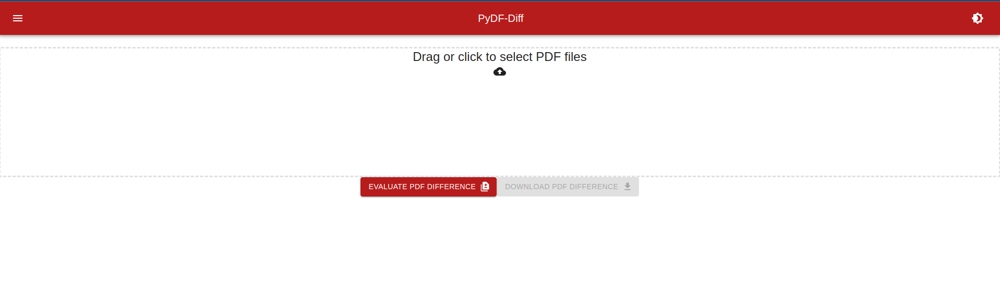

# PyDF-Diff
*Python-Hosted Web PDF Diff Tool*




## Supporting Frameworks

* [pdf-diff](https://github.com/JoshData/pdf-diff)
* [FastAPI](https://fastapi.tiangolo.com/)
* [MaterialUI](https://mui.com/material-ui/getting-started/overview/)
* [react-mui-dropzone](https://github.com/lifeeric/material-ui-dropzone)


## Roadmap

* Expose existing options in web-ui
    * top_margin
    * bottom_margin
    * width
    * style
* Add automatic email-sending of completed differences
    * Support configuration from environment variables
* Recognize device theme choices (light/dark)
* Retain light/dark theme selection
* Support conversion to rendered PDF prior to download
* Improve concurrent operations

## Basic Deployment Configuration

*:warning: This application is largely untested, and has not been optimized.*

```yaml
version: "3.9"

# PyDF-Diff Example Configuration
services:
  webui:
    image: ghcr.io/engineerjoe440/pydf-diff:main
    ports:
      - 8081:80
    restart: always
```

See the [example `docker-compose.yml` file in the repository](https://github.com/engineerjoe440/PyDF-Diff/blob/main/docker-compose.yml)
for a general example.
